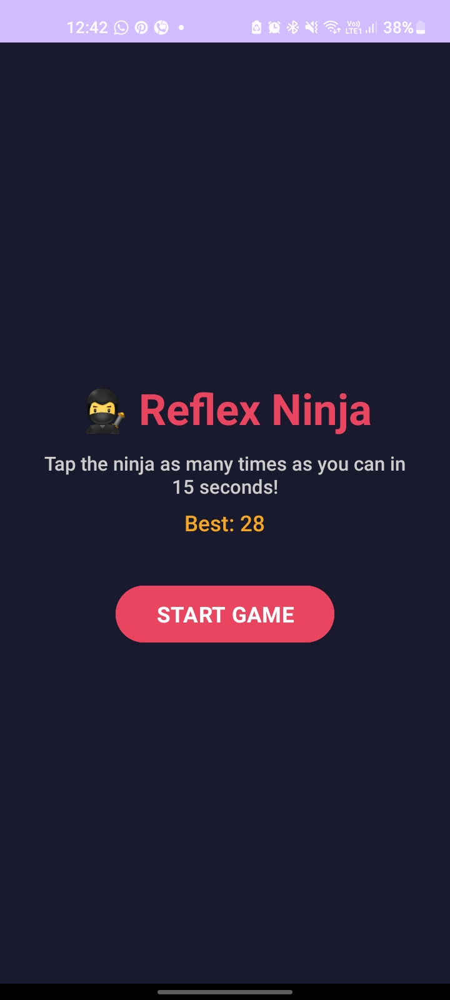
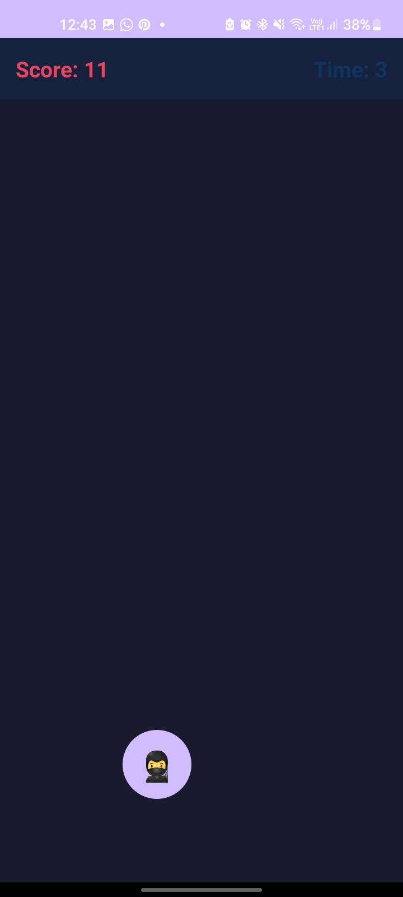

# 🎮 Reflex Ninja

A simple reflex-based mobile game built with Kotlin and Android.

Reflex Ninja is a lightweight game focused on reaction speed, timing, and user interaction. The project was built to explore Android development, game logic, touch interactions, scoring, and interactive UI design.

#App download link- "https://drive.google.com/file/d/10PSMy_5ORbhYI6Kvfjte0GJJ6pp7yM-w/view?usp=sharing"

## 🎮 Gameplay

The objective is simple: react quickly to on-screen targets and achieve the highest possible score.

### Screenshots

  
  

## ✨ Features

- ⚡ Reflex-based gameplay
- 🎯 Interactive touch controls
- 🏆 Score tracking
- 📱 Android mobile UI
- 🎮 Game-state and scoring logic
- 🔄 Replayable gameplay

## 🛠️ Tech Stack

- **Language:** Kotlin
- **Platform:** Android
- **IDE:** Android Studio
- **UI:** Android UI
- **Game Logic:** Kotlin

## 🧠 What I Learned

- Android application development with Kotlin
- Handling touch-based user interactions
- Implementing game states and scoring logic
- Designing interactive mobile interfaces
- Structuring a small game application

## 🚀 Running Locally

1. Clone the repository.
2. Open the project in Android Studio.
3. Allow Gradle dependencies to sync.
4. Run the application on an Android emulator or connected device.

## 👩‍💻 Author

**Shreya Dubey**

[GitHub](https://github.com/shreyad2806)
